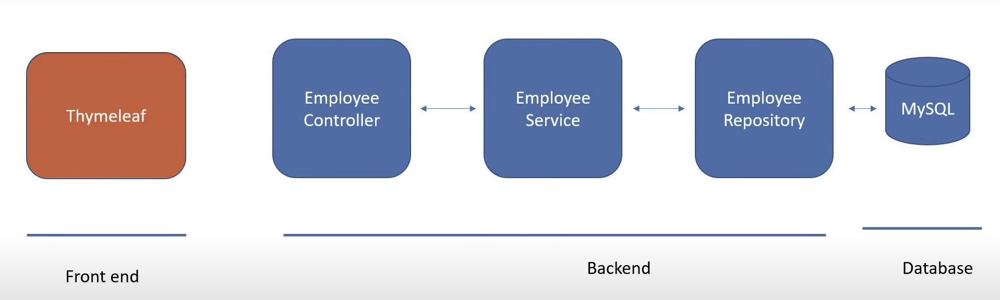
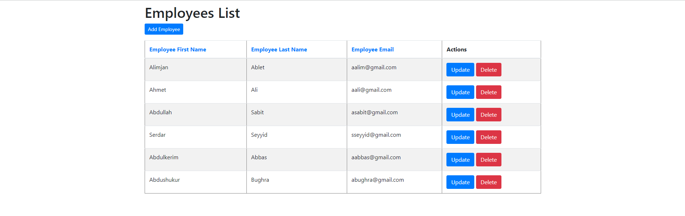

# Employee Management System

---

## Project Requirements
Create a web application for Employee Management System
User should be able to:
- Get All the employees
- Add a new employee
- Update an employee
- Delete an employee

---
## Application Architecture


---
## Technologies Used:
1. Spring Boot 2.2.6 +
2. Spring Framework 5.2.5 +
3. Maven 3.2 +
4. Java 8
5. Spring Data Jpa (Hibernate)
6. Thymeleaf

---

## Steps:
1. Create and Setup Spring Boot Project in Intellij IDEA Ultimate
2. Configure MySQL Database
3. Implement End-to-End List Employee Feature
4. Implement End-to-End Add Employee Feature
5. Implement End-to-End Update Employee Feature
6. Implement End-to-End Delete Employee Feature

---

```
Results:
```
1. Save Employee :


---
2. Update Employee:


---
3. Employee List :


---
